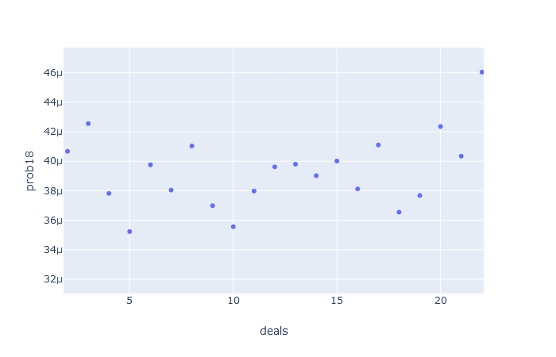

# Set Simulator

This program simulates Set games to count how often hands contain no sets.

The raw probability of a given hand containing no sets is quite low.
Randomly selecting cards you get the following probability of containing sets:
<ul>
<li>12 cards is .9677</li>
<li>15 cards is .9996</li>
<li>18 cards is .99999999</li>
</ul>

In actual games 12 and 15 card hands have no sets much more often than this.
This program investigates how the probability of encountering a hand with no sets changes as the game progresses.

Other's analysis has shown that the probability of getting hands with no sets in game is higher than randomly selecting cards.
This leads to the intuitive hypothesis that as sets are removed from the hand and random cards replace them, the
"quality" of the hand and deck decreases. By quality I mean the likelyhood of a hand, regardless of size, containing a set
decreases as the game is played. When discussing this hypothesis with another math enthusiast they rejected it on the claim
that 12 card hands would decrease in quality but the following 15 card hand would have a consistent probability of containing a set.

It turns out we were both wrong. The probability is variable but in an interesting way. I currently don't have a convincing hypothesis why.

## Running the Simulation

Included in the python/data/ folder is the output of the simulation run a number of times.
This folder keeps growing the more I run the simulation.
To start fresh, delete the contents of this folder.

If you want to run this simulation yourself clone the repository.
```bash
git clone https://github.com/aujxn/set_game_simulator.git
cd set_game_simulator
```

At this step you have enough to generate the raw data. To run the program you must have rustc or cargo installed.
Replace <number_of_games> with how many games you would like to run. On my very old quad core AMD 1_000_000 games
takes about 5 seconds. The program utilizes however many cores your machine has available using the Rayon crate.
Make sure to include the release flag or it will take forever. The output data is exported to ./python/data.txt.
The program must be run from the project root so it can find the output folder for the data.
```bash
cargo run --release <number_of_games>
```

And if you would like to generate the plotly graphs, create and activate a python virtual environment and get the required libraries.
```bash
python3 -m venv venv
source ./venv/bin/activate
pip install -r requirements.txt
```

The python script must alse be run from the project root to find the data file.
Navigate to localhost:8050 in your browser to see the plots.
```bash
python3 ./python/graph.py
```

## Results

Here are the graphs from the data in ./python/data. This data represents >5 billion games of set played.
The x-axis is how many times new cards have been added to the hand from the deck.
This means the further right on the graph is further along in the game.
The y-axis is the probability of a hand having no sets. Each graph represents a different size hand scenario.


The 12 card hands act mostly as expected. The probability of a 12 card hand having no sets starts off low because the initial 12 cards are
completely random. As the game is played and sets are removed and replaced with random cards, the probability of a setless 12 cards hand
increases at a logarithmic rate. The 23rd (last) deal of cards into the hand is interesting, though. If there are only 12 cards remaining
when the last cards are added from the deck into the hand the probability of a setless hand jumps up slightly.


This is where things get very confusing. When 15 card hands are encountered after one and two deals (when either the original 12 has no sets
or it has a set but the new 12 after has no sets) the probability of the 15 cards containing no sets is the highest. Followed by a sharp
decline to the second lowest probability at 5 deals.
From deal 5 to deal 22 the probability increases linearly, but the 23 deal has the lowest probability.


At first glance the probability of an 18 card hand looks fairly consistent except for the anomaly of the last deal from the deck. It is
interesting that the last deal has about 12 times the probability of containing no sets.



After focusing in on those lower data points some wavy shape is identifiable. I ran this overnight, over 5 billion games, to see if
the trend would become more obvious but the results are still quite noisy.

## Summary

I am interested in why the last deal breaks the trends for every hand size in an alternating manner. I think the next step to investigate
this phenomenon is to look at the total number of sets in the hand at every point in the game and see how it develops. Another concern I
have is that these particular findings are a result of how I am searching for and removing sets from the game. My functions that find a
set search in the same order every time and removes the first set it encounters. I could see this affecting the results by favoring
sets that don't contain the new cards because it begins by looking at the begining of the hand. To make it more "human-like" I could find all
the sets in a hand and randomly select one to remove from the deck. Arguably, this still isn't very human like. A basic strategy for a human
could be taking a survey of which attribute states are most or least common and generating some intuition on which cards are most likely
to be part of sets.

I have a very limited understanding of combinatorics and graph theory so maybe the explanation is quite obvious. Regardless, I think this
is a cool representaion of how emergent properties can result from a simple set of rules.

## TODO
<ul>
<li>Add some more comments and a README for the data format</li>
<li>Analyze total number of sets at each point in the game</li>
<li>Try removing random sets instead of the first set encountered</li>
</ul>


## Credit
Inspired by analysis by [Peter Norvig](https://norvig.com/SET.html) and [Don Knuth](https://cs.stanford.edu/~knuth/programs/setset-all.w)
as well as conversations with Neil Babson.

## Licence
[MIT](https://choosealicense.com/licenses/mit)
