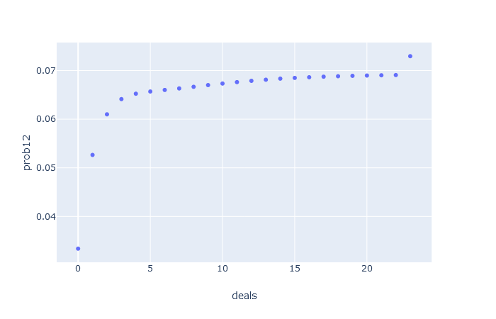
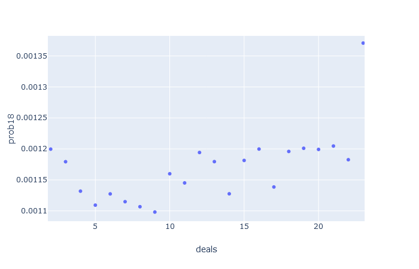

# Set Simulator

This program simulates Set games to count how often hands contain no sets.

The raw probability of a given hand containing no sets is quite low.
Randomly selecting cards you get the following probability of containing sets:
<ul>
<li>12 cards is .9677</li>
<li>15 cards is .9996</li>
<li>18 cards is .99999999</li>
<\ul>

In actual games 12 and 15 card hands have no sets much more often than this.
This program investigates how the probability of encountering a hand with no sets changes as the game progresses.

Other's analysis has shown that the probability of getting hands with no sets in game is higher than randomly selecting cards.
This leads to the intuitive hypothesis that as sets are removed from the hand and random cards replace them, the
"quality" of the hand and deck decreases. By quality I mean the likelyhood of a hand, regardless of size, containing a set
decreases as the game is played. When discussing this hypothesis with another math enthusiast they rejected it on the claim
that 12 card hands would decrease in quality but the following 15 card hand would have a consistent probability of containing a set.

It turns out we were both wrong. The probability is variable but in an interesting way. I currently don't have a convincing hypothesis why.

## Running the Simulation

Included in the python folder is the output of the simulation run on 1_000_000_000 games.

If you want to run this simulation yourself clone the repository.
```bash
git clone https://github.com/aujxn/set_game_simulator.git
cd set_game_simulator
```

At this step you have enough to generate the raw data. To run the program you must have rustc or cargo installed.
Make sure to include the release flag or it will take forever. The output data is exported to ./python/data.txt
```bash
cargo run --release
```

And if you would like to generate the plotly graphs, create and activate a python virtual environment and get the required libraries.
```bash
python3 -m venv venv
source ./venv/bin/activate
pip install -r requirements.txt
```

The python script must be run from the root of the project to find the data file. Navigate to localhost:8050 in your browser to see the plots.
```bash
python3 ./python/graph.py
```

## Results

Here are the graphs from the 1_000_000_000 game run. The x-axis is how many times new cards have been added to the hand from the deck.
The y-axis is the probability of a hand having no sets. Each graph represents a different size hand scenario.



The 12 card hands act mostly as expected. The probability of a 12 card hand having no sets starts off low because the initial 12 cards are
completely random. As the game is played and sets are removed and replaced with random cards, the probability of a setless 12 cards hand
increases at a logarithmic rate. The 23rd (last) deal of cards into the hand is interesting, though. If there are only 12 cards remaining
when the last cards are added from the deck into the hand the probability of a setless hand jumps to 11%.


This is where things get very confusing. When 15 card hands are encountered after one and two deals (when either the original 12 has no sets
or it has a set but the new 12 after has no sets) the probability of the 15 cards containing no sets is the highest. Followed by a sharp
decline to the lowest probability at 5 deals where it nearly increases linearly from there.



There might be some shape with the 18 card hand probabilities as well but because it is so unlikely that an 18 card hand contains no
sets the data has a lot of noise in it. I might run it a few more times to see if it converges on some nice shape but I expect it would
require a massive data set.

I have a very limited understanding of combinatorics and graph theory so maybe the explanation is quite obvious. Regardless, I think this
is a cool representaion of how emergent properties can result from a simple set of rules.

## TODO
<ul>
<li>Add some more comments and a README for the data format</li>
<li>Add command line argument for selecting number of games</li>
<li>Have option for each run to accumulate data instead of wiping old data</li>
<li>Analyze total number of sets at each point in the game</li>
<li>Try removing random sets instead of the first set encountered</li>
</ul>


## Credit
Inspired by analysis by [Peter Norvig](https://norvig.com/SET.html) and [Don Knuth](https://cs.stanford.edu/~knuth/programs/setset-all.w)
as well as conversations with Neil Babson.

## Licence
[MIT](https://choosealicense.com/licenses/mit)
