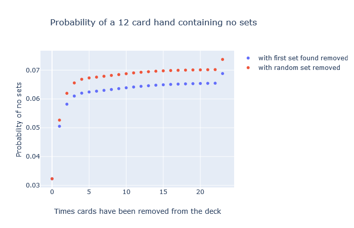
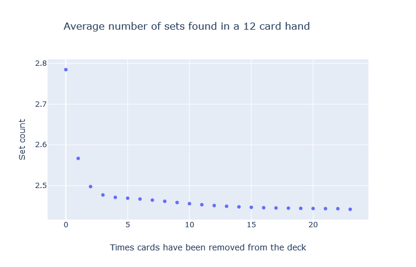
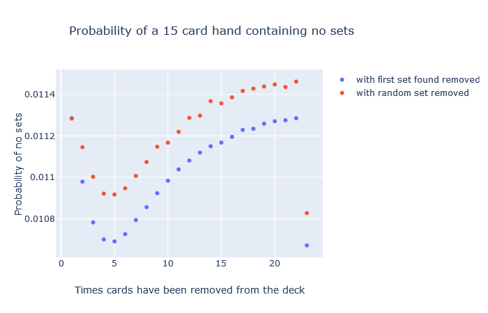
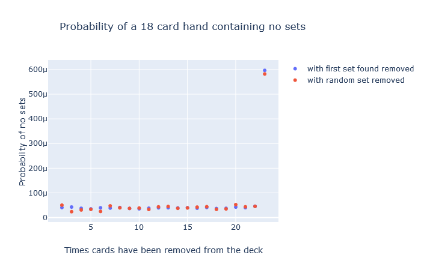
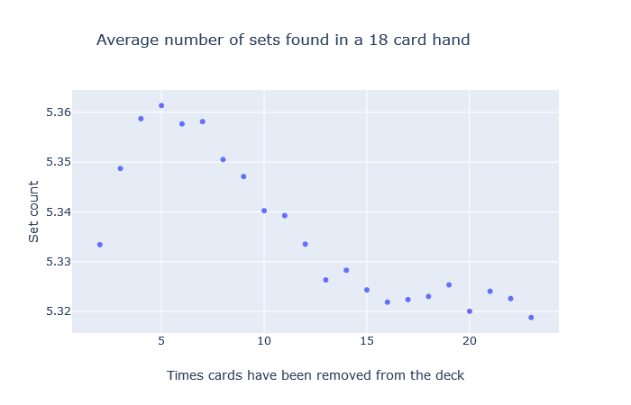
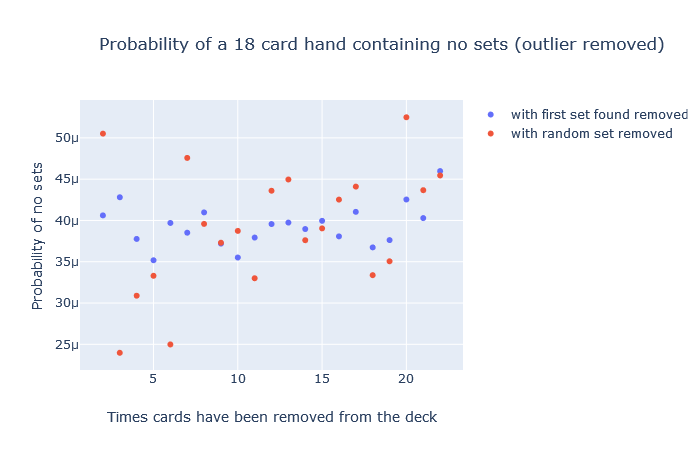

# Set Simulator

This program implements a Monte Carlo simulation for playing the game Set.
The goal is to explore and understand probabilities of certain events in the game.

The raw probability of a given hand containing no sets is quite low.
Randomly selecting cards you get the following probability of containing sets:
<ul>
<li>12 cards is .9677</li>
<li>15 cards is .9996</li>
<li>18 cards is .99999999</li>
</ul>

In actual games 12 and 15 card hands have no sets much more often than this.
This program investigates how the probability of encountering a hand with no sets changes as the game progresses.

Other's analysis has shown that the probability of getting hands with no sets in game is higher than randomly selecting cards.
This leads to the intuitive hypothesis that as sets are removed from the hand and random cards replace them, the
"quality" of the hand and deck decreases. By quality I mean the likelyhood of a hand, regardless of size, containing a set
decreases as the game is played. When discussing this hypothesis with another math enthusiast they rejected it on the claim
that 12 card hands would decrease in quality but the following 15 card hand would have a consistent probability of containing a set.

It turns out we were both wrong. The probability is variable but in an interesting way. I currently don't have a convincing hypothesis why.

## Running the Simulation

Included in the python/data/ folder is the output of the simulation run a number of times.
This folder keeps growing the more I run the simulation.
To start fresh, delete the contents of this folder.

If you want to run this simulation yourself clone the repository.
```bash
git clone https://github.com/aujxn/set_game_simulator.git
cd set_game_simulator
```

At this step you have enough to generate the raw data. To run the program you must have rustc or cargo installed.
The program requires one of two subcommands --- rmfirst and findall. rmfirst removes the first set that is encountered
and findall locates all the sets in the hand and removes one at random. Both these subcommands require a number of games
argument.
The program must be run from the project root so it can find the output folder for the data. python/data/find_all and python/data/rm_first
contain data files from running the program. To start fresh delete the files in these two folders.
Make sure to include the release flag or it will take forever. 1_000_000 is a reasonable number of games.
```bash
cargo run --release -- <subcommand> <number_of_games>
```

And if you would like to generate the plotly graphs, create and activate a python virtual environment and get the required libraries.
```bash
python3 -m venv venv
source ./venv/bin/activate
pip install -r requirements.txt
```

The python script must alse be run from the project root to find the data file.
Navigate to localhost:8050 in your browser to see the plots.
```bash
python3 ./python/graph.py
```

## Results



The 12 card hands act mostly as expected. The probability of a 12 card hand having no sets starts off low because the initial 12 cards are
completely random. As the game is played and sets are removed and replaced with random cards, the probability of a setless 12 cards hand
increases at a logarithmic rate. The 23rd (last) deal of cards into the hand is interesting, though. Initially I suspected this deviation was
a bug but after writing another simulation that removes a random set and getting the same results I am less concerned.
It is interesting that removing random sets elevates the probability of setless hands but doesn't change the distribution.



Looking at the average number of sets for 12 card hands isn't suprising.




This is where things get more interesting.
I don't have an intuitve explanation for why the probabilies act like this. I collected and graphed data about how many unique cards were
in the set of sets. This turned out not being very informative. I think the next step is to look at the sets like vectors in 4 dimensional
space. There are a few different classes of sets described by where the collinear vectors fall on the hypercube that represents all sets.
Looking at the frequency and probabilities of these classes might be informative to what is happening here.





Setless 18 card hands are so rare that the data is pretty noisy. As the hands get larger the end deviation gets more drastic.
Looking at the average set count shows that there is consistent development that looks a lot like the 15 card hands.



Removing the outlier shows this noise.

## Summary

The probabilities of setless 12 card hands is as expected. 15 and 18 card hands have more interesting behaviour. The next step
I am going to take is categorizing sets based on their location in 4d space and seeing how these categories act over time.

I have a very limited understanding of combinatorics and graph theory so maybe the explanation is quite obvious. Regardless, I think this
is a cool representaion of how emergent properties can result from a simple set of rules.

## Credit
Inspired by analysis by [Peter Norvig](https://norvig.com/SET.html) and [Don Knuth](https://cs.stanford.edu/~knuth/programs/setset-all.w)
as well as conversations with Neil Babson.

## Licence
[MIT](https://choosealicense.com/licenses/mit)
